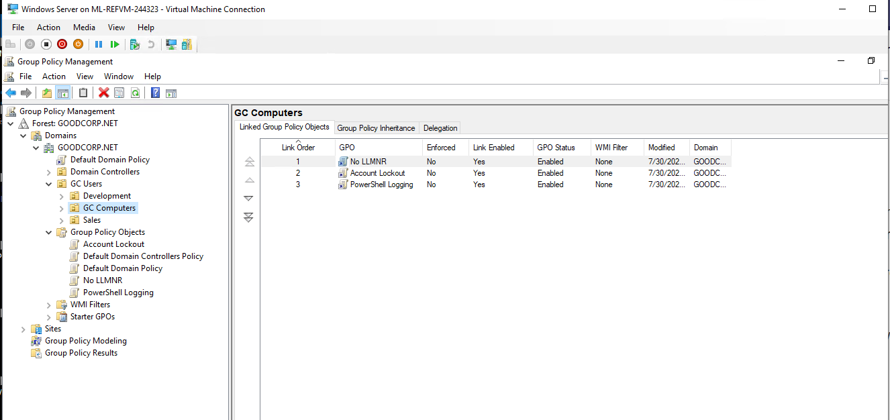
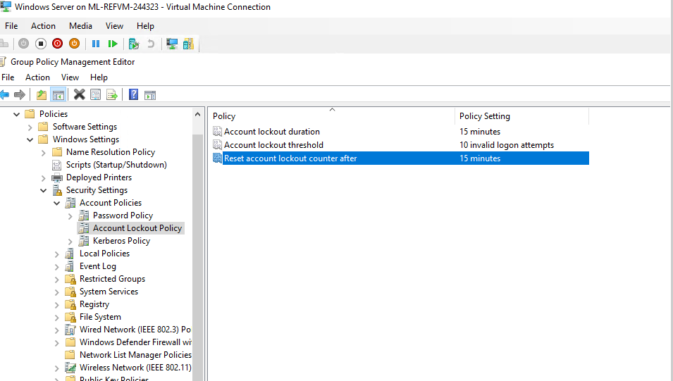
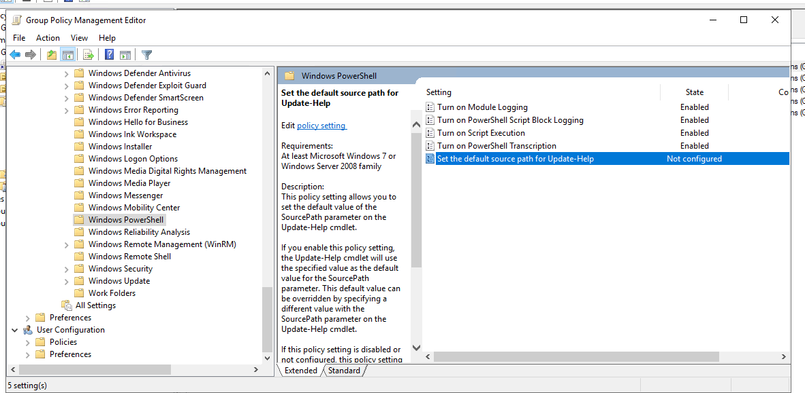
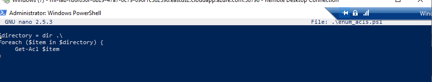
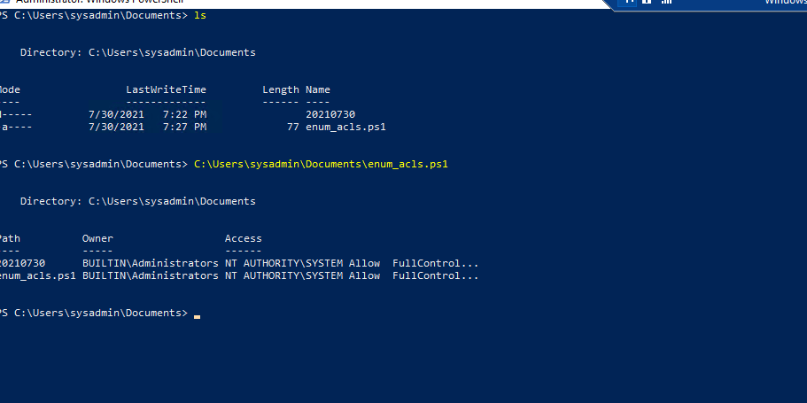

## A Day in the Life of a Windows Sysadmin

### Task 1: Create a GPO: Disable Local Link Multicast Name Resolution (LLMNR)

Create a Group Policy Object that prevents your domain-joined Windows machine from using LLMNR:
On the top-right of the Server Manager screen, open the Group Policy Management tool to create a new GPO.
Right-click Group Policy Objects and select New.
Name the Group Policy Object No LLMNR.
Right-click the new No LLMNR GPO listing and select Edit to open the Group Policy Management Editor and find policies.
In the Group Policy Management Editor, the policy you are looking for is at the following path: Computer Configuration\Policies\Administrative Templates\Network\DNS Client.
Find the policy called Turn Off Multicast Name Resolution.
Enable this policy.
Exit the Group Policy Management Editor and link the GPO to the GC Computers organizational unit you previously created.

- **

### Task 2: Create a GPO: Account Lockout

Create what you believe to be a reasonable account lockout Group Policy for the Windows 10 machine.
Name the Group Policy Object Account Lockout.
You can use Microsoft's 10/15/15 recommendation if you'd like.
When editing policies for this new GPO, keep in mind that you're looking for computer configuration policies to apply to your GC Computers OU. Also, these policies involve Windows security settings and accounts.
Don't forget to link the GPO to your GC Computers organizational unit.

- **

### Task 3: Create a GPO: Enabling Verbose PowerShell Logging and Transcription

Name the Group Policy Object PowerShell Logging.
Find the proper Windows Powershell policy in Group Policy Management Editor.
Hint: Check out the computer configuration, administrative templates, and Windows component directories.
Enable the Turn on Module Logging and do the following:
Click Show next to Module Names.
Since we want to log all PowerShell modules, enter an asterisk * (wildcard) for the Module Name, then click OK.
Enable the Turn on PowerShell Script Block Logging policy.
This policy uses the following template to log what is executed in the script block:

- *$collection =* 

- *foreach ($item in $collection) {*

- *<Everything here will get logged by this policy>*

*}*

Make sure to check the Log script block invocation start/stop events: setting.
Enable the Turn on Script Execution policy and do the following:
Set Execution Policy to Allow all scripts.
Note: Do you remember the Set-ExecutionPolicy cmdlet we ran during the PowerShell exercises? This policy can enforce those settings as part of a GPO.
Enable the Turn on PowerShell Transcription policy and do the following:
Leave the Transcript output directory blank (this defaults to the user's ~\Documents directory).
Note: "Transcription" means that an exact copy of the the commands are created in an output directory.
Check the Include invocation headers option. This will add timestamps to the command transcriptions.
Leave the Set the default source path for Update-Help policy as Not configured.
Link this new PowerShell Logging GPO to the GC C

- **

### Task 4: Create a Script: Enumerate Access Control Lists

Create a PowerShell script that will enumerate the Access Control List of each file or subdirectory within the current working directory.
Create a foreach loop. You can use the following template:

- *foreach ($item in $directory) {*

- *<Script block>*

- *}*

Above the foreach condition, set a variable, $directory, to the contents of the current directory.
Replace the script block placeholder with the command to enumerate the ACL of a file, using the $item variable in place of the file name.
You'll need to use the following cmdlets:

- *Get-ChildItem (or any alias of Get-ChildItem, such as ls or dir)*

- *Get-Acl*
Save this script in C:\Users\sysadmin\Documents as enum_acls.ps1.
Test this script by moving to any directory (cd C:\Windows), and running C:\Users\sysadmin\Documents\enum_acls.ps1 (enter the full path and file name).

- **

### Bonus Task 5: Verify Your PowerShell Logging GPO

Run gpupdate in an administrative PowerShell window to pull the latest Active Directory changes.
Close and relaunch PowerShell into an administrative session.
Navigate to a directory you want to see the ACLs in. You can go to C:\Windows, as you did in Task 4.
Run the enum_acls.ps1 script using the full file path and name such as the one in Task 4.
Check the C:\Users\sysadmin\Documents for your new logs.
You should see a directory with the current date (for example, 20200908) as the directory name. Your new transcribed PowerShell logs should be inside.

- **